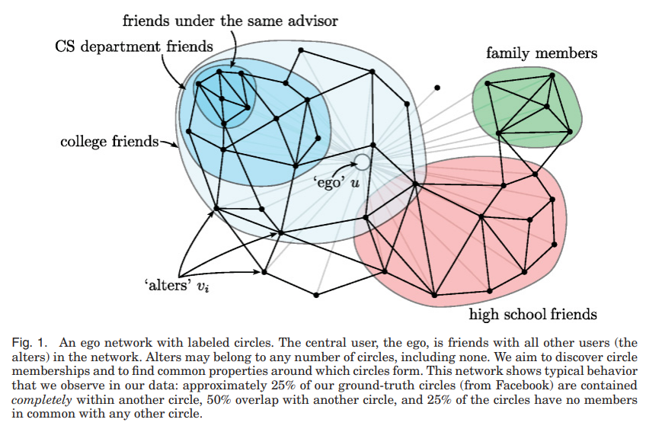
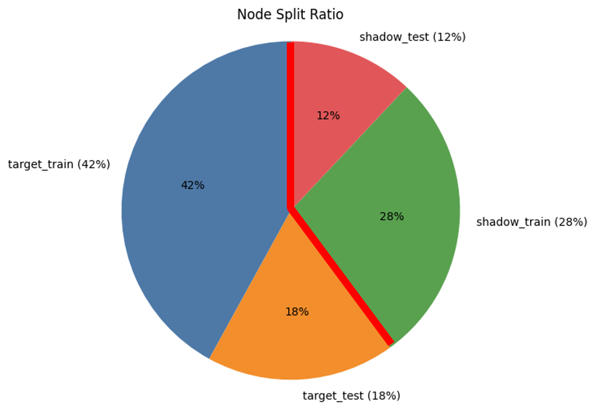

# Google Plus Social Network Dataset: Multi-label Classification Privacy & Membership Inference Attack

## 0. Purpose

본 프로젝트의 목적은 **social network 기반 multi-label classification 모델**에서의 **privacy 취약성**을 분석하는 것입니다.  
특히, **membership inference attack(MIA)**을 통해 모델이 특정 데이터를 학습에 사용했는지 여부를 추론할 수 있는지 평가하고,  
**노이즈 삽입(Confidence-Adaptive Noise)**와 같은 방어 기법이 MIA에 미치는 영향을 실험적으로 검증합니다.

---

## 1. Social Dataset - Google Plus Dataset

_McAuley, J., & Leskovec, J. "Discovering social circles in ego networks." ACM Transactions on Knowledge Discovery from Data._


- **데이터셋**: [Google Plus (Google+)]  
  - **노드(Node)**: 사용자 계정  
  - **엣지(Edge)**: 사용자 간 관계  
  - **특징(Feature)**: 익명화된 바이너리 프로필 벡터 (feature dim: 19,044)  
  - **라벨(Label)**: 사용자가 속한 social group (circle) - **멀티레이블**  
  - 데이터 상세:  
    - `0.feat` : 각 이웃 노드의 feature  
    - `0.egofeat` : ego 본인 feature  
    - `0.edge` : 관계 정보  
    - `0.circles` : group label

---

## 2. Membership Inference Attack (MIA)

- **공격 목적**:  
  모델의 출력(logits 또는 확률)만을 관찰하고, **특정 샘플이 학습 데이터셋에 포함되어 있었는지**(IN/OUT) 판별

_Data Split._

- **공격 방식**:  
  1. **Shadow Model** 방식 사용  
      - 타겟 모델과 동일 구조의 shadow 모델 여러 개를 학습  
      - shadow train, shadow test 구분  
  2. 각 샘플의 **출력 및 예측 정보**(confidence, entropy 등)로 attack feature 생성  
  3. **공격 모델(Attack Model)**: 로지스틱 회귀 (이진 분류기)  
      - 입력: 샘플의 prediction feature  
      - 출력: IN/OUT 판별

- **평가지표**:  
  - Attack Accuracy, F1 (macro/micro), Precision macro, Recall macro

---

## 3. Confidence-Adaptive Noise (노이즈 삽입 방어)

Membership inference 공격은 **모델의 예측 확신(confidence)**에 크게 의존합니다.  
이를 완화하기 위해, **예측 확신이 높을수록 적은 노이즈**, **낮을수록 큰 노이즈**를 출력에 추가하는 방어 기법을 도입합니다.

### Implementation: `confidence_adaptive_noise`

```python
import torch

def confidence_adaptive_noise(logits, base_scale=0.2, min_scale=0.05, gamma=1.0):
    """
    logits: (N, C) torch.Tensor (N: 노드 수, C: label 수)
    base_scale: 최대 노이즈 scale (낮은 confidence에 적용)
    min_scale: 최소 노이즈 scale (높은 confidence에 적용)
    gamma: non-linearity 제어 (1이면 선형, 2면 비선형)
    반환: noise가 더해진 logits
    """
    probs = torch.sigmoid(logits)
    # scale: 높은 확률(확신)일수록 noise 적게, 낮을수록 noise 크게
    scale = min_scale + (base_scale - min_scale) * (1 - probs) ** gamma  # (N, C)

    noise = torch.distributions.Laplace(0, scale).sample().to(logits.device)
    logits_noisy = logits + noise
    return logits_noisy